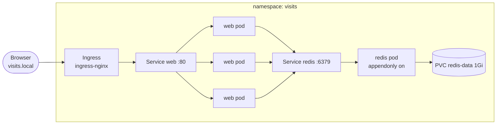

# k8s-multi-container-app

A two-tier app on Kubernetes: a Flask web service (3 replicas) that counts visits in Redis, which keeps its data on a PersistentVolume. Traffic comes in through an NGINX Ingress. Built and tested on Minikube.


> I'm learning Kubernetes hands-on. This repo is my lab: the manifests, plus notes from deliberately breaking things and fixing them.

## Architecture



## What's in it

| File | What it does |
|---|---|
| `app/` | Flask app served by gunicorn, running as a non-root user. `/` counts visits, `/healthz` is the liveness check, `/readyz` checks Redis |
| `k8s/10-redis.yaml` | Redis with append-only persistence on a PVC. `Recreate` strategy, because a ReadWriteOnce volume can't attach to two pods |
| `k8s/20-web.yaml` | ConfigMap, a 3-replica Deployment with probes, resource limits and zero-downtime rolling updates, a Service and an Ingress |
| `.github/workflows/ci.yml` | Validates the manifests with kubeconform, builds the image and smoke-tests it |

## Run it on Minikube

```bash
minikube start
minikube addons enable ingress

# Build the image straight into Minikube (no registry needed)
minikube image build -t visits-web:1.0 app/

kubectl apply -f k8s/
kubectl -n visits get pods -w          # wait until everything is Running and READY

# Point visits.local at Minikube
echo "$(minikube ip) visits.local" | sudo tee -a /etc/hosts
curl http://visits.local/
```

On Windows or macOS with the Docker driver, run `minikube tunnel` in a separate terminal and use `127.0.0.1 visits.local` in your hosts file instead.

Hit it a few times: `visits` goes up and `pod` changes as the Service spreads requests across the replicas.

## Failure experiments

Each one is something I ran to see how Kubernetes behaves, not just to read about it.

**1. Does data survive the database pod dying?**
```bash
curl -s http://visits.local/ | grep visits        # note the count
kubectl -n visits delete pod -l app=redis
kubectl -n visits get pods -w                     # new redis pod starts
curl -s http://visits.local/ | grep visits        # count continues, doesn't reset
```
*Why:* the PVC outlives the pod, and `--appendonly yes` makes Redis replay its write log on startup.

**2. What does readiness actually do?**
```bash
kubectl -n visits scale deploy redis --replicas=0
kubectl -n visits get pods                        # web pods go 0/1 READY
curl -i http://visits.local/                      # 503 from the Ingress: no ready endpoints
kubectl -n visits scale deploy redis --replicas=1
```
*Why:* `/readyz` fails without Redis, so Kubernetes takes the web pods out of the Service. Because liveness only checks the process, the pods are **not** restarted.

**3. Debugging a broken Ingress.** Change the Ingress backend service name to `web-typo` and apply it.
```bash
kubectl -n visits describe ingress web            # shows the backend it can't resolve
kubectl -n ingress-nginx logs deploy/ingress-nginx-controller | tail
```

**4. Zero-downtime rollout.** Change `GREETING` in the ConfigMap, then run `kubectl -n visits rollout restart deploy/web` while a loop keeps calling `curl`. With `maxUnavailable: 0`, no request should fail.

## Lessons learned

*Filled in after running the experiments above.*

- …

## Next steps

- HorizontalPodAutoscaler on CPU (needs `minikube addons enable metrics-server`)
- Package it as a Helm chart
- Run it on EKS with an ALB Ingress Controller and EBS-backed volumes
